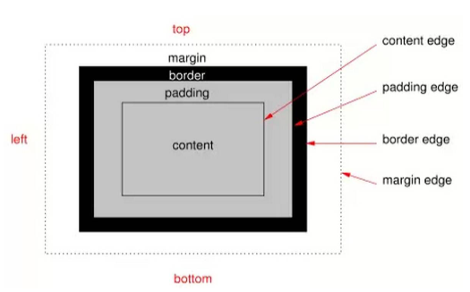

# CSS Box Model

Salah satu konsep dasar yang wajib dipahami di dalam CSS adalah tentang box model. Dalam bab ini kita akan membahas dengan detail tentang CSS box model, yang terdiri dari lebar dan tinggi konten (width & height), padding, border, dan margin.

## Pengertian _CSS Box Model_

   _CSS Box Model_ adalah sebuah konsep dimana setiap element yang terdapat pada halaman web diproses sebagai kotak (box). Mulai dari paragraf, _header_, _form_, gambar, logo hingga video, sebenarnya di tampilkan oleh web browser sebagai ‘box’.

   Sebagaimana layaknya ‘kotak’, masing-masing element HTML ini terdiri dari 4 lapisan, yakni: konten (isi), _padding, border_ dan _margin_. Keempat ‘lapisan’ inilah yang membangun _CSS Box Model_.

   
