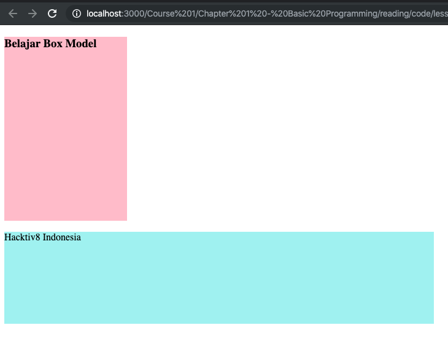
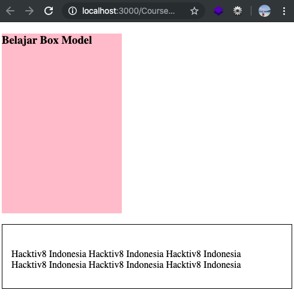

# Property Pada Box Model

## Property width dan height

   Pembahasan mengenai _Box Model_ akan kita mulai dari konten utama sebuah _element_. Untuk mengatur lebar dan tinggi _element_, bisa menggunakan _property width_ dan _height_. Kedua _property_ ini mendukung seluruh satuan nilai _‘length’_ yang telah kita bahas dalam bab sebelumnya, seperti **px, em, %,** dan **rem**.

   Berikut contoh penggunaan property width dan height:

   ```html
   <!DOCTYPE html>
   <html>
     <head>
       <meta charset="UTF-8" />
       <title>Belajar CSS</title>
       <style>
         h3 {
           width: 200px;
           height: 300px;
           background-color: pink;
         }

         p {
           width: 700px;
           height: 150px;
           background-color: paleturquoise;
         }
       </style>
     </head>

     <body>
       <h3>Belajar Box Model</h3>
       <p>Hacktiv8 Indonesia</p>
     </body>
   </html>
   ```

   

## Property Padding

   Lapisan kedua dari konsep box model adalah _padding_. _Padding_ merupakan ruang atau ‘spasi’ antara konten dengan garis tepi (border) sebuah element. _Padding_ digunakan agar konten tidak menempel langsung dengan garis tepi. Anda bisa melihat fungsi _padding_ dari gambar box model pada awal bab ini.

   Untuk menggunakan _padding_, terdapat beberapa cara. Cara pertama adalah dengan menulis nilai _padding_ untuk setiap arah secara terpisah, yakni atas, bawah, kiri dan kanan, yang dalam bahasa inggris menjadi top, bottom, left dan right.
   Penulisannya menggunakan property berikut:

- padding-top
- padding-bottom
- padding-left
- padding-right

   Untuk menghafal urutan ini, bisa menggunakan arah jarum jam atau menggunakan singkatan TRouBLe (Top Right Bottom Left).

   Property padding mendukung semua nilai _‘length’_ CSS, seperti px, em, %, dll. Berikut contoh kode HTML + CSSnya:

   ```html
   <!DOCTYPE html>
   <html>
     <head>
       <meta charset="UTF-8" />
       <title>Belajar CSS</title>
       <style>
         h3 {
           width: 200px;
           height: 300px;
           background-color: pink;
         }

         p {
           padding-top: 40px;
           padding-bottom: 30px;
           padding-left: 15px;
           padding-right: 25px;
           border: 1px solid black;
         }
       </style>
     </head>

     <body>
       <h3>Belajar Box Model</h3>
       <p>
         Hacktiv8 Indonesia Hacktiv8 Indonesia Hacktiv8 Indonesia Hacktiv8
         Indonesia Hacktiv8 Indonesia Hacktiv8 Indonesia
       </p>
     </body>
   </html>
   ```

   

## Property Margin

   Lapisan terakhir dari _box model_ adalah _margin_. _Margin_ merupakan ‘spasi’ atau ‘ruang kosong’ yang berada di sisi paling luar sebuah element. _Margin_ bersifat transparan (tidak bisa diwarnai) dan digunakan sebagai pemisah antara satu element dengan element lainnya.

   Kita sudah menyinggung sedikit tentang _margin_ dalam bab tentang _typography_. Dimana _margin-bottom_ saya gunakan untuk mengatur spasi/jarak antar paragraf. Seperti yang bisa ditebak, terdapat _margin-top_, _margin-right_, dan _margin-left_. Satuan yang bisa digunakan adalah satuan _‘length’_ seperti **pixel, em, rem,** atau **persen**.

   _Margin_ mendukung penulisan longhand notation dan shorthand notation. Penggunaan kedu- anya mirip dengan property _padding_, dimana untuk longhand notation kita bisa mengatur setiap sisi dengan property: _margin-top_, _margin-right_, _margin-bottom_ dan _margin-left_. Sedangkan untuk shorthand notation cukup dengan _property margin_ yang bisa diisi dengan 1, 2, 3 atau 4 nilai.

   Karena aturan penulisan _margin_ hampir sama dengan _padding_ (masih ingat **TRouBLe?**).
