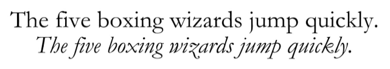
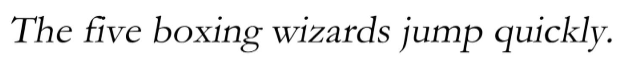

# CSS Typography

**Typography** adalah sebuah seni mengatur huruf/teks untuk membuatnya lebih mudah dibaca dan menarik secara visual. Teks merupakan konten utama dari hampir semua _website_. Walaupun anda membuat web yang fokus kepada multimedia (gambar dan video), namun tetap memer- lukan teks untuk bagian keterangan/deskripsi. Menu navigasi sebuah _website_ juga hampir semuanya terdiri dari teks.

Kali ini kita akan fokus membahas cara penggunaan property **CSS** yang berkaitan dengan typography atau teks. Selain itu, saya juga akan membahas konsep-konsep dasar property CSS seperti nilai length, nilai color (#RBG, HSL), _font_, dan text.

## Property Font

1. Font - Family

    Pembahasan mengenai property CSS kita mulai dengan font-family. Property ini digunakan untuk mengatur jenis font. Nilai dari property font-family adalah nama font yang ingin digunakan. Berikut contoh penulisannya:

     ```css
     p {
       font-family: Arial;
     }
     ```

     Kode **CSS** diatas akan men-set jenis **font Arial** pada semua paragraf. Akan tetapi, dari manakah font ini diambil?

     Property font-family akan mencari font di dalam komputer _client_, yakni di dalam komputer pengunjung _web browser_, bukan di dalam komputer server tempat _website_ berada.

     Ini berarti kode **CSS** diatas hanya akan ditampilkan dengan font Arial apabila di dalam komputer pengunjung terdapat font bernama “Arial”. Jika tidak ditemukan, _web browser_ akan menentukan sendiri font yang akan digunakan (tergantung settingan default _web browser_ tersebut).

     Untuk mengantisipasi tidak tersedianya sebuah font, kita bisa memberikan alternatif font pengganti, seperti contoh berikut:

     ```css
     p {
       font-family: Arial, Helvetica, sans-serif;
     }
     ```

     Kali ini, kode CSS diatas memberikan pilihan kepada web browser: Cari seluruh tag `<p>`, kemudian gunakan _font Arial_. Apabila tidak ditemukan, gunakan _font Helvetica_. Apabila tidak ditemukan juga, gunakan font generic dengan tipe sans-serif.

     CSS tidak membatasi seberapa banyak font alternatif yang bisa dipersiapkan, bisa 1, 3, bahkan 10 font:

     ```css
     body {
       font-family: Arial, Helvetica, Verdana, Geneva, Impact, Charcoal, sans-serif;
     }
     ```

2. Font - Size

     CSS menyediakan beragam satuan untuk mengatur ukuran font, yang semuanya di-set melalui property font-size.
     Berikut contoh penggunaannya:

     ```css
     p {
       font-size: 14px;
     }
     ```

     Kode CSS diatas berarti: cari seluruh tag `<p>`, kemudian set ukuran font sebesar 14 pixel. Selain menggunakan satuan pixel, CSS menyediakan berbagai satuan lain yang bisa digunakan untuk mengatur ukuran font.

     > Jika kita tidak mendefenisikan ukuran font, sebuah teks akan ditampilkan menggu- nakan style default web browser. Biasanya ukuran teks default adalah sebesar 16 pixel.

3. Font - Style

     Nama property ini seolah-olah memiliki banyak fungsi, namun property font-style hanya digunakan untuk memiringkan text (_italic_). Nilai yang bisa diinput adalah salah satu dari normal, **italic** dan **oblique**.

     Pada kebanyakan _font_, tampilan dari _font-style_: _italic_ dan _font-style_: _oblique_ akan sama, karena biasanya sebuah font hanya mendukung salah satu saja (biasanya hanya _italic_).

     Dalam teori **typography**, _italic_ dan _oblique_ merupakan tipe font yang sepenuhnya berbeda.

     _Font italic_ adalah sebuah tipe font khusus yang tidak hanya tampil miring, tetapi menggunakan ‘huruf’ yang berbeda dari font normal (memiliki file font sendiri). Beberapa _font italic_ ada mirip dengan tulisan tangan, terutama pada huruf ‘a’ kecil, seperti contoh berikut:

     

     _Font oblique_ adalah jenis font normal yang hanya dimiringkan beberapa derajat. Umumnya, tampilan yang dihasilkan tidak sebagus tipe italic. Dengan menggunakan jenis font yang sama, tampilan font Garamond dengan tipe oblique adalah sebagai berikut:

     

     Sekarang dapat terlihat perbedaan dari italic dan oblique.
