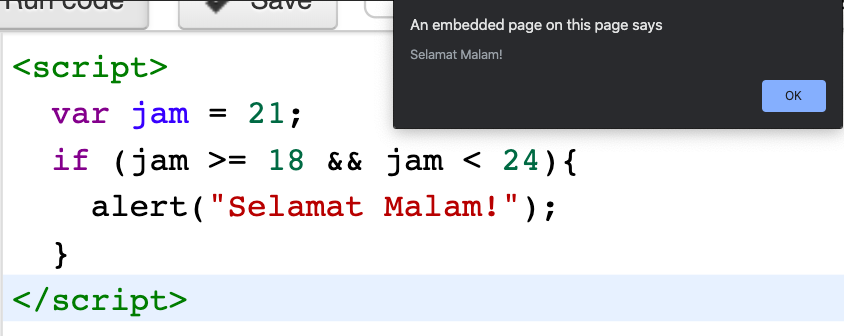
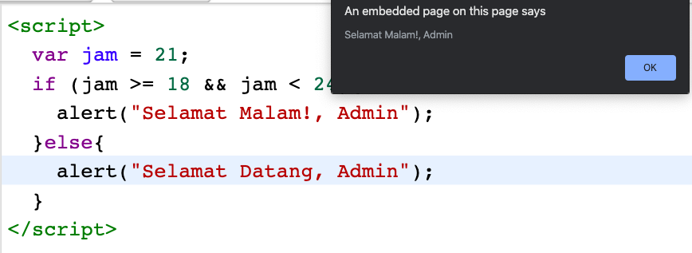
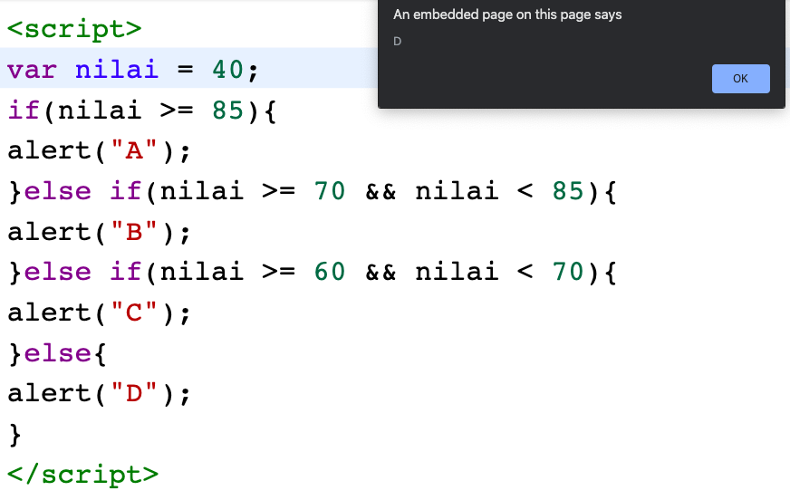

# Kondisional Pada Javascript

**Statement kondisional** berfungsi untuk mengecek suatu kondisi dan melakukan suatu jika kondisi tersebut bernilai benar atau salah. **Statement kondisional** ini akan kita butuhkan ketika kita ingin melakukan “sesuatu” yang berbeda berdasarkan kondisinya.

Dalam dunia coding, **statement kondisional** ini merupakan sesuatu yang paling sering digunakan.

JavaScript memiliki 4 **statement kondisional**, yaitu:

1. IF
2. IF.. ELSE..
3. IF.. ELSE IF.. ELSE..
4. SWITCH

## Statement IF Pada JavaScript

_Statement if_ dapat kita gunakan untuk menentukan aksi apa yang ingin kita lakukan ketika suatu kondisi bernilai benar.

Sintax :

```js
if ( kondisi ) {
script yang di jalankan jika benar
}
```

contoh :

```js
<script>
  var jam = 21;
  if (jam >= 18 && jam < 24){
    alert("Selamat Malam!");
  }
</script>
```

Apabila kode program tersebut dijalankan, maka hasilnya akan seperti ini:



Pastikan menulis statement dengan huruf kecil semua, apabila menggunakan huruf kapital (_IF_) atau campuran (_If_) maka akan menghasilkan **error**.

## Statement if…else

Jika statement _if_ digunakan untuk menentukan aksi apa yang dilakukan apabila kondisi bernilai _true_ maka _else_ digunakan untuk menentukan aksi apa yang dilakukan apabila kondisinya bernilai _false_.

Sebenarnya ini hampir sama dengan _If_ namun perbedaannya adalah dia akan menjalan _script_ jika kondisi bernilai salah.

Sintax :

```js
if(kondisi){
kode yang dijalankan jika benar
}else{
kode yang dijalankan jika salah
}
```

contoh :

```js
<script>
  var jam = 21;
  if (jam >= 18 && jam < 24){
    alert("Selamat Malam!, Admin");
  }else{
    alert("Selamat Datang, Admin");
  }
</script>
```

Apabila kode program tersebut dijalankan, maka hasilnya akan seperti ini:



## Statement if…else if…else

**Statemen if..else** digunakan untuk menentukan sesuatu aksi dengan satu kondisi yang diuji, landasan yang menentukan aksi apa yang akan dilakukan adalah jika kondisi benar dan jika kondisi salah (jika benar dan jika salah pada satu kondisi yang diuji)

Sedangkan statemen _if..else if…else_ digunakan apabila ada lebih dari satu kondisi yang di uji, misalnya:

jika kondisi A yang memenuhi syarat, maka lakukan A, jika kondisi B yang memenuhi syarat maka lakukan B, jika tidak keduanya (else) maka lakukan C.

Sintax :

```js
if(kondisi 1){
kode yang dijalankan jika kondisi 1 benar
}else if(kondisi 2){
kode yang dijalankan jika kondisi 2 benar
}else if(kondisi 3){
kode yang dijalankan jika kondisi 3 benar
}else{
kode jika salah satu kondisi di atas tidak ada yang benar
}
```

Contoh :

```js
<script>
var nilai = 40;
if(nilai >= 85){
alert("A");
}else if(nilai >= 70 && nilai < 85){
alert("B");
}else if(nilai >= 60 && nilai < 70){
alert("C");
}else{
alert("D");
}
</script>
```

Apabila kode program tersebut dijalankan, maka hasilnya akan seperti ini:



## Statement Switch

**Statement switch** digunakan untuk melakukan aksi yang berbeda-beda berdasarkan kondisinya. _Switch_ dapat kita gunakan untuk memilih satu dari beberapa blok kode yang tersedia tergantung dari kondisi yang sesuai.

Sintaxs:

```js
<script>
switch(ekspresi){
  case x:
      blok kode
      break;
  case y:
      blok kode
      break;
  case z:
      blok kode
      break;
  default:
      blok kode
}
</script>
```

Cara kerjanya:

1. Ekspresi dari _switch_ akan dievalusi terlebih dahulu
2. Kemudian nilai dari ekspresi tersebut akan dibandingkan dengan nilai dari setiap case yang ada
3. Apabila ada yang sesuai, maka blok kode yang berasosiasi dengan case yang bersesuaian akan dieksekusi.
4. Apabila tidak ada yang sesuai, maka blok kode yang terdapat pada default akan dieksekusi.

Contoh:

```js
<script>
var tanggal = 5;
switch (tanggal) {
case 0:
day = "Minggu";
break;
case 1:
day = "Senin";
break;
case 2:
day = "Selasa";
break;
case 3:
day = "Rabu";
break;
case 4:
day = "Kamis";
break;
case 5:
day = "Jumat";
break;
case 6:
day = "Sabtu";
}
</script>
```

Jika kode program tersebut dijalankan, maka hasilnya adalah Jumat karena memiliki Tanggal memiliki angka 5.

### Statement Break

Pada _statement switch_ diatas, dapat kita temukan kata kunci break, untuk apa disematkan break tersebut?

Ketika JavaScript “bertemu” dengan kata _break_ maka JavaScript akan berhenti dan keluar dari blok kode _switch_ tersebut, sehingga eksekusi kode berikutnya dan pengujian case didalam blok kode tersebut dihentikan.

Ketika case yang sesuai sudah ditemukan, dan beberapa perintah yang sesuai telah selesai dieksekusi maka pekerjaan selesai, saatnya berhenti, pengujian pada case dibawahnya tidak perlu dilakukan lagi.

Break pada bagian akhir blok tidak diperlukan, karena tanpa break pun blok kode akan berhenti dan keluar dengan sendirinya disetiap akhir dari blok.

### Statement Default

Kata kunci _default_ digunakan untuk menentukan kode yang dieksekusi apabila tidak satupun ekspresi yang sesuai dengan case yang ada.

Contoh:

```js
<script>
var hari = 2;
switch (hari) {
    case 6:
        text = "Kerjakan Tugas Algoritma!";
        break;
    case 5:
        text = "Kerjakan Tugas Kalkulus!";
        break;
    default:
        text = "Tidak Ada Tugas!";
}
</script>
```

Hasil dari kode diatas adalah **“Tidak Ada Tugas!**”.

Menempatkan default tidak mesti paling bawah, kita dapat menaruhnya pada bagian atas dari blok kodenya.

Contoh:

```js
<script>
var hari = 2;
    switch (hari) {
        default:
            text = Tidak Ada Tugas!";
            break;
        case 5:
            text = "Kerjakan Tugas Algoritma!";
            break;
        case 0:
            text = "Kerjakan Tugas Kalkulus!";
}
</script>
```

Namun yang mesti kita ingat, jika kita naruh default pada awal blok kode, maka isilah dengan **break**.
