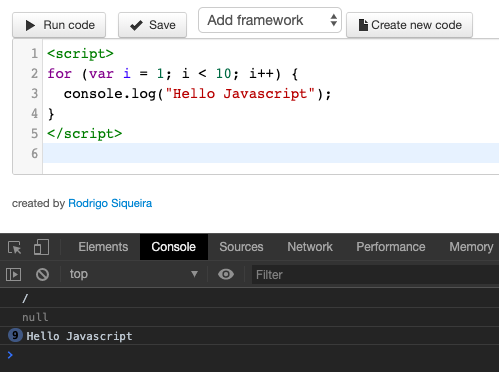
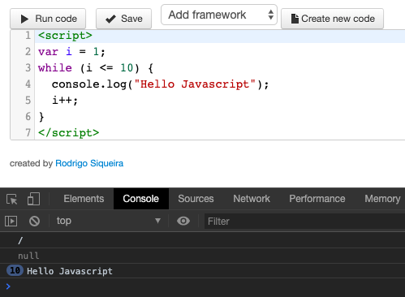
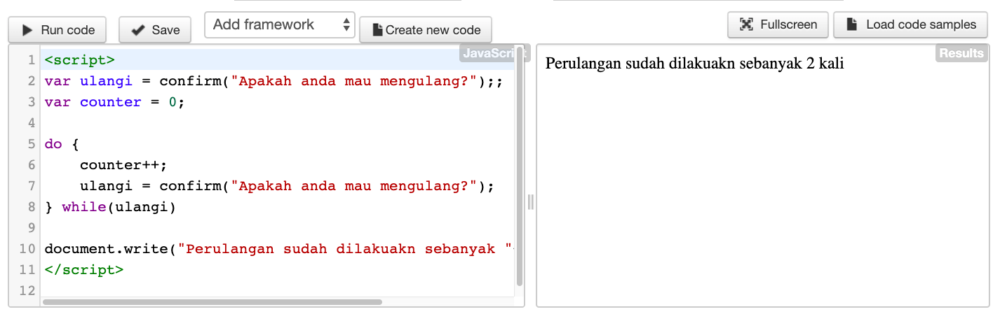
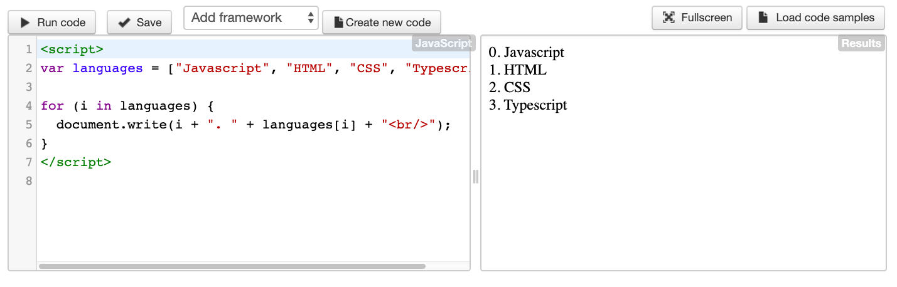

# Pengenalan Perulangan di Javascript

**Perulangan** atau dalam bahasa inggris disebut sebagai **loop**, adalah struktur kode program yang digunakan untuk mengulang beberapa baris perintah. Dengan menggunakan perulangan, sangat memudahkan kita dalam menjalankan perintah yang sama secara terus menerus.

Ada **lima macam** bentuk perulangan di _Javascript_. Secara umum, perulangan ini dibagi dua, Yaitu:

1. **Counted loop**

   **Counted Loop** merupakan perulangan yang jelas dan sudah tentu banyak perulangannya.
   Perulangan yang termasuk dalam Counted Loop:

   - Perulangan For
   - Perulangan Foreach
   - Perulangan Repeat

2. **Uncounted loop**

   **Uncounted Loop**, merupakan perulangan yang tidak jelas berapa kali ia harus mengulan.

   Perulangan yang termasuk dalam Uncounted Loop:

   - Perulangan While
   - Perulangan Do/While

Untuk pembahasan nya, mari kita bahas satu-persatu :

## Perulangan For di Javascript

Perulangan for merupakan perulangan yang termasuk dalam couted loop, karena sudah jelas berapa kali ia akan mengulang.

Berikut format dasar perulangan **for** dalam _Javascript_:

```js
for (start; condition; increment) {
  statement;
}
```

- **Start** diisi dengan kondisi awal dari perulangan. Biasanya kita mendefinisikan sebuah variabel counter yang berfungsi untuk mengontrol perulangan.

  sebagai contohnya, saya bisa menuis `var i = 1`. variabel disini berperan sebagai **variabel counter**

- **Condition** biasanya diisi dengan operasi perbandingan, selama operasi ini menghasilkan **nilai true**, perulangan akan dijalankan terus.

  Sebagai contoh nya, jika saya menulis `i < 10`, artinya perulangan akan terus dijalankan selama nilai variabel `i` kurang dari `10`

- **Increment** diisi dengan instruksi untuk menaikkan nilai variabel counter. Dalam setiap perulangan, baris ini akan dieksekusi.

  Sebagai contohnya, saya bisa membuat `i++` , yang artinya nilai variabel `i` akan naik 1 angka dalam setiap perulangan.

Mari kita lihat contoh prakteknya:

```js
for (var i = 1; i < 10; i++) {
  console.log("Hello Javascript");
}
```

Hasilnya adalah


## Perulangan While di Javascript

Perulangan kedua yang akan kita bahas adalah **while**. Perulangan ini mirip seperti perilangan **for**, tapi dengan memecah bagian **start, condition,** dan **increment**.

Berikut format dasar perulangan **while** di Javascript:

```js
start;
 while (condition) {
  statement;
  increment;
}

atau seperti ini

while (ulangi) {
    counter++;
    ulangi = confirm("Apakah anda mau mengulang?");
}
```

langsung saja kita lihat contohnya

```js
var i = 1;
while (i <= 10) {
  console.log("Hello Javascript");
  i++;
}
```

disini saya membuat perulangan **while** sebanyak 10 kali, dimulai dari `i = 1`, sampai dengan `i <= 10`. Setiap perulangan di-_increment_ sebanyak 1 angka (i++). Hasilnya "Hello Javascript tampil sebanyak 10 kali.

Hasilnya adalah


## Perulangan Do/While di Javascript

Perulangan do/while sama seperti perulangan while.

**Perbedaanya**:

Perulangan do/while akan melakukan perulangan sebanyak 1 kali terlebih dahulu, lalu mengecek kondisi yang ada di dalam kurung while.

Bentuknya seperti ini:

```js
do {
    // blok kode yang akan diulang
} while (<kondisi>);
```

> Jadi perbedaan nya :
> Perulangan do/while akan mengecek kondisi di belakang (sesudah mengulang), sedangkan while akan mencek kondisi di depan atau awal (sbelum mengulang).
> langsung saja kita lihat contohnya pada program ini

```js
var ulangi = confirm("Apakah anda mau mengulang?");
var counter = 0;

do {
  counter++;
  ulangi = confirm("Apakah anda mau mengulang?");
} while (ulangi);

document.write("Perulangan sudah dilakuakn sebanyak " + counter + " kali");
```

Hasilnya adalah


## Perulangan Foreach di Javascript

Perulangan **foreach** biasanya digunakan untuk mencetak item di dalam array.

Perulangan ini termasuk dalam perulangan _counted loop_, karena jumlah perulangannya akan dituentukan oleh panjang dari array.

Ada dua cara menggunakan perulangan **foreach** di Javascript:

Menggunakan **for** dengan operator **in**;

Contoh:
Berikut ini bentuk perulangan `“foreach”` tanpa menggunakan operator **in**:

Mengguunakan method **forEach()**.

```js
var languages = ["Javascript", "HTML", "CSS", "Typescript"];

for (i = 0; i < languages.length; i++) {
  document.write(i + ". " + languages[i] + "<br/>");
}
```

Perulangan ini dapat dibuat lebih sederhana lagi dengan menggunakan operator **in**, seperti ini:

```js
var languages = ["Javascript", "HTML", "CSS", "Typescript"];

for (i in languages) {
  document.write(i + ". " + languages[i] + "<br/>");
}
```

Hasilnya adalah :


