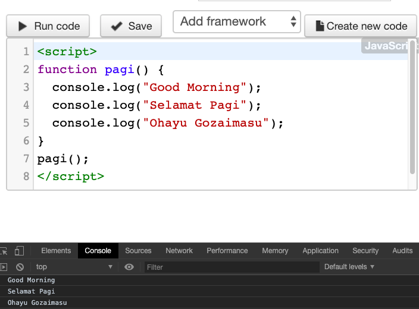

# Mengenal Function pada Javascript

Untuk membuat sebuah program besar, sebaiknya dipecah menjadi sub program yang lebih
kecil, lalu secara bersama-sama membangun aplikasi akhir. Dalam pemrograman _JavaScript_, sub program ini dikenal dengan istilah **function**.

Function di dalam _JavaScript_ juga cukup unik, karena bisa disimpan ke dalam variabel, atau dijadikan sebagai _argument_. Istilah programmingnya, function di _JavaScript_ disebut adalah
sebagai **First-class citizen**.

Selain itu setiap variabel yang ada di dalam function memiliki scope atau ruang lingkup yang terbatas. Dalam bab ini kita akan membahas tentang _function JavaScript_, serta bagaimana cara
penggunaannya.

## Pengertian Function

**Function** atau dalam bahasa indonesia disebut sebagai **fungsi**, adalah kumpulan kode program yang dirancang untuk menyelesaikan sebuah tugas tertentu, dan merupakan bagian dari program utama. _Function_ diperlukan untuk memecah alur program yang besar menjadi beberapa program kecil agar mudah di kelola.

Setiap _function_ punya tugas dan fungsi masing-masing. Bisa saja di dalam sebuah _function_ terdapat _function_ lain, tergantung kompleksitas masalah yang ingin dipecahkan.

_JavaScript_ sendiri memiliki ratusan _function_ bawaan yang bisa digunakan, seperti fungsi _alert()_. Selain itu, kita juga bisa membuat fungsi sendiri.

> Dalam bab ini kita akan fokus kepada cara membuat fungsi sendiri (_user defined function_).

Berikut format dasar pembuatan function di dalam JavaScript:

```js
function function.name (argumenti, argument2,...) (
    statement:
    statement:
    return value:
)
```

Setelah _keyword `function`_, diikuti dengan _function_name_._Function_name_ ini merupakan nama dari fungsi tersebut. Penulisan nama fungsi mengikuti aturan dari **identifier**, atau dengan kata lain mengikuti aturan pembuatan _variabel_, yakni tidak boleh diawali angka, tidak boleh mengandung spasi, dst.

Setiap function bisa memiliki 1 atau beberapa _argument_, **Argument** adalah variabel yang berfungsi sebagai nilai _input_ ke dalam function. _Argument_ ditulis di dalam tanda kurung setelah _function_name_.

**Block function** ditandai dengan tanda kurung kurawal. Di sinilah kode program JavaScript yang membentuk function ditulis. Perintah **return** digunakan sebagai output function. Penulisan
_argument_ dan perintah _return_ bersifat opsional dan boleh tidak ditulis.

## Membuat dan Memanggil Function

Kita akan merancang function _pagi()_ yang menampilkan kata "Selamat Pagi" dalam 3 bahasa:

```js
function pagi() {
  console.log("Good Morning");
  console.log("Selamat Pagi");
  console.log("Ohayu Gozaimasu");
}
```

Fungsi ini terdiri dari 4 baris kode program _JavaScript_, didalamnya saya menampilkan 4 buah _string_ menggunakan perintah `console.log( )`.

Fungsi diatas tidak memiliki _argument_, namun tetap harus ditulis dengan tanda kurung kosong: `pagi ()`. Inilah yang membedakan sebuah fungsi dengan _identifier_ lain seperti variabel. Jika anda menemukan saya menulis sebuah kata diikuti dengan tanda kurung kosong, artinya itu sebuah _function_.

Menulis fungsi seperti ini disebut juga dengan **function declaration** atau pendeklarasian fungsi.

Jika anda jalankan kode program diatas, tidak akan tampil apa-apa. Karena kita harus “memanggil” fungsi ini terlebih dahulu. Bagaimana caranya? Cukup dengan menulis nama fungsi tersebut, seperti contoh berikut:

```js
function pagi() {
  console.log("Good Morning");
  console.log("Selamat Pagi");
  console.log("Ohayu Gozaimasu");
}
pagi();
```



## Mengembalikan Nilai Function

**Fungsi pagi ()** yang kita rancang sebelum ini sangat praktis untuk menampilkan 4 salam dalam setiap kali pemanggilan. Tapi bagaimana jika saya ingin salam ini tidak langsung tampil, tapi
ditampung dulu ke dalam variabel (untuk nantinya diproses lagi)? Kita bisa menggunakan keyword **return**. Perintah **return** akan mengembalikan suatu nilai ketika fungsi ini dipanggil.

Mari kita lihat contoh penggunaan nya

```js
function pagi() {
  return "Selamat Pagi";
}
```

Kali ini saya mengubah **funsi pagi ()** menjadi hanya 1 baris: return "Selamat Pagi". Dengan demikian, saya bisa menjalankannya sebagai berikut:

```js
function pagi() {
  return "Selamat Pagi";
}

var salam = pagi();
console.log(salam);
```

Hasilnya adalah : Selamat Pagi

Perhatikan cara pemanggilan fungsi _pagi()_, kali ini saya menyabungnya menggunakan _operator assignment_. Dengan kata lain,hasil dari fungsi _pagi()_, akan disimpan ke dalam variabel _salam_. Setelah itu, apa isi dari variabel _salam_ ini? Adalah string `"Selamat Pagi"`.

Selain menampungnya ke dalam variabel, saya juga bisa menulis seperti ini:

```js
function pagi() {
  return "Selamat Pagi";
}

console.log((pagi());
```

Apakah teman-teman bisa menebak apa yang ditampilkan oleh perintah _console.log(pagi())_? String "Selamat Pagi". Ini berasal dati perintah `return "Selamat Pagi"` yang langsung ditampilkan oleh `console.log()`.
